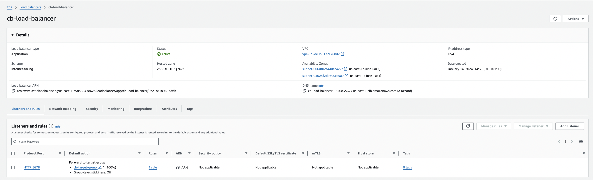
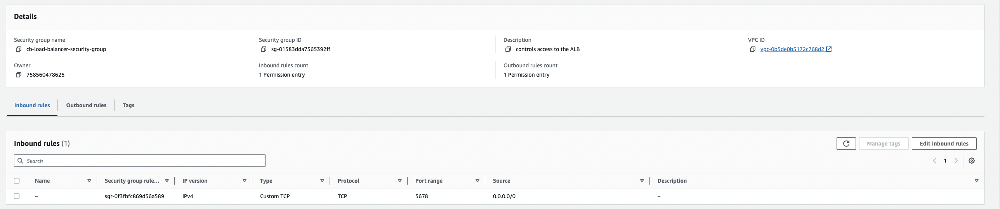
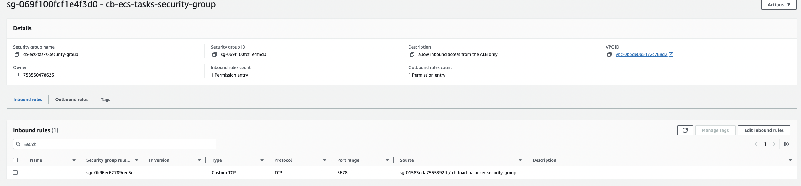
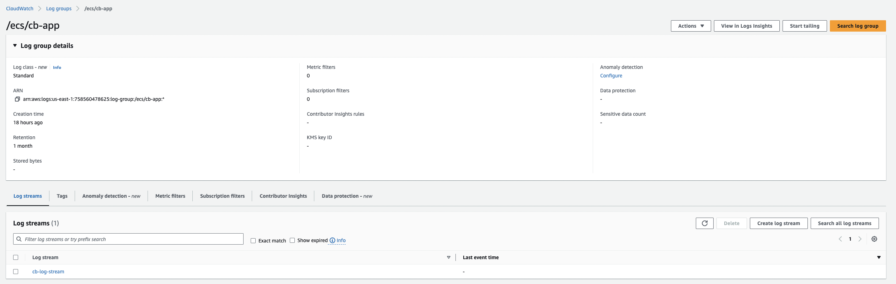
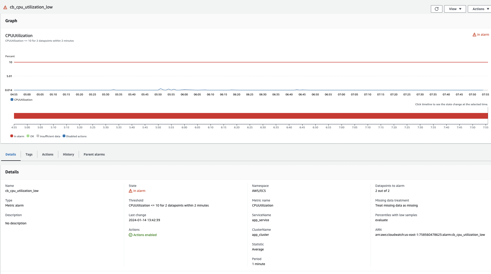
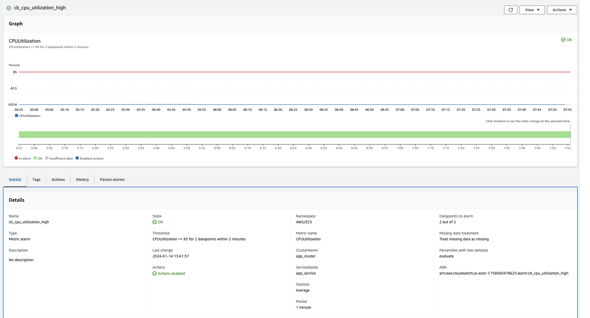

# HTTP ECHO PROJECT

### About
This project deploys a GO webserver that echoes `Hello World` when visited on the browser. The application image is being containerized to make it durable, lightweight, platform-independent and self-healing.

### The tools used are:

*  Version Control: `Git`
*  Infrastructure Provisioning: `Terraform`
*  Cloud Environment: `AWS`
*  Image Repository: `AWS ECR`
*  CI/CD Tool: `Github Action`
*  Frontend: `AWS ELB`
*  Backend: `Serverless AWS ECS (Fargate launch type)`
*  Logs: `CloudWatch log`
*  Monitoring: `CloudWatch Dashboard`
*  Notifications: `SNS Topic`, `Github Approval`

### General Project Flow
1. Terraform files, pipeline file, and task definition files are created locally and pushed to Github 
2. The branches in use are: Main and Dev
3. Based on the pipeline flow, Github action workflow is triggered on-push and the stages are run.
4. Automated approval is triggered in prod, and the reviewer has to approve before deployment takes place. 
5. Upon successful workflow run, the infrastructure and deployment are reflected in AWS, and the app is reachable on http://cb-load-balancer-1620835627.us-east-1.elb.amazonaws.com:5678/
 
### Step1: Scalability and Security
AWS ECS was employed which is a managed container orchestration service. Fargate serverless type was used in order not to manage the underlying EC2 instances. Using ECS makes the deployment and scaling easy, and the task definition houses the container requirements. 

High Availability/Scalability/Loadbalancing: AWS ELB `cb-load-balancer` with subnets from different AZs and it distributes incoming traffic to the ECS tasks. linked to the ECS service named `app-service`. ASG in turn scales on CPU metric targets the ECS service and scales up/down when the Task CPU utilization is greater than 85 or lesser than 10. CloudWatch alarm triggers the scaling, which the ASG policy will respond to. Furthermore, an SNS alarm to email is triggered when scaling occurs.

Fault-Tolerance: The AWS ECS as an orchestration service is self-healing. Coupled with the service definition and Auto-Scaling in place, the number of required tasks is always kept running. Furthermore, different subnets are in use, so failure or outage in 1 AZ will not affect the application. Also, multiple environments (dev and prod) are in place. This is to ensure that all tests are carried out in staging (dev) before pushing to prod. A reviewer will be notified by email for approval and deployment

Security: The architecture is built such that, the ELB is in a public subnet while the ECS cluster is in a private subnet with the least required privileges allowed in the security groups. This prevents direct access to the containers. Also, IAM permissions are based on the least privileges.

### Step2: Infrastructure Deployment
Iac tools are employed for the deployment. Git is used for version controlling and Terraform is used to provision the serverless cluster and set up all the required resources. Next, the image is pulled from the docker repo https://hub.docker.com/r/hashicorp/http-echo/ and then scanned and pushed to an ECR repo. Then the CICD pipeline takes care of updating the task definition file and deploying to the ECS cluster.

### Step3: CICD

The pipeline used was Github Actions, and the CICD file can be found in `.github/workflow/aws.yml` It was used because it doesn't require extra server provisioning such as Jenkins. Another option that was considered was AWS CodePipeline, but not used.

The CICD file was created to push to both prod and dev environments, depending on the git branch ref. The file consisted of 2 stages for each env. Each stage has multiple steps. 

1.) Building and testing: This covers checkout, credentials configuration, formatting, validating, planning, and applying infrastructure files which are in the terraform directory

2.) Deployment: This stage covers pulling, tagging, and pushing the docker image to ECR. Furthermore, it updates the task definition file with the image ID and deploys it to the ECS cluster.

If the `github.ref=='refs/heads/main'` on push, the workflow triggers an approval process, where the reviewer gets an email. The deployment can only be continued upon approval

Environment secrets such as AWS secret and Access keys are stored and encrypted in Github secrets and passed as a variable in the pipeline.

### Step4: Deployment Strategies
The deployment strategy used is Rolling Updating. This will ensure that there is no downtime during deployment. The `deployment_maximum_percent` is set to 200 while the `deployment_minimum_healthy_percent` is 100

### Step5: Monitoring and Logging
CloudWatch(CW) was employed for monitoring and logging. The application logs flow to Cloudwatch logs and stream, and the deployment is being monitored from CW dashboard. Critical metrics alerts and Infrastructure logs are sent to CW dashboard.

Also, CW alarm triggers the auto-scaling policy and SNS sends alerts and notifications to the subscriber when scaling happens.

### Steps to Reproduce
1.) Update the terraform file, such as the vars.tf, and backend.

2.) Add secrets to the CICD server

3.) Create 2 git branches dev and main

4.) Add Github deployment reviewer from Github repo--->Settings--->Environments--->Deployment protection rule--->Required reviewers

# Potential Next Steps

1.) Adding an SSL/TLS certificate to the ALB

2.) Introducing DNS, and accepting traffic from DNS server--->ELB
